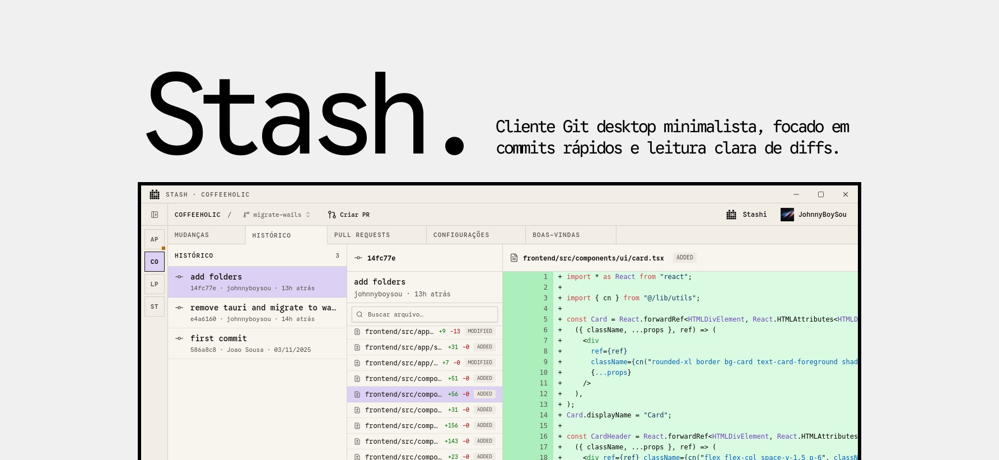

<p align="center">
  
</p>

<h1 align="center">stash</h1>

<p align="center">
  Cliente Git/GitHub desktop minimalista, construído com Wails v3, Go e React.
</p>

<p align="center">
  <a href="https://github.com/johnnyboysou/stash/actions/workflows/ci.yml"></a>
  <a href="https://github.com/johnnyboysou/stash/releases/latest"></a>
  
  
  
</p>

---

## Visão geral

`stash` é uma aplicação desktop nativa para gerenciamento de repositórios Git e fluxos de Pull Request no GitHub. Foca em densidade de informação, navegação por teclado e ausência de fricção: tudo em uma única janela, sem painéis flutuantes ou cerimônia visual.

## Recursos

- **Gerenciamento multi-repo** — coleções persistidas, com sidebar colapsável e fixação de favoritos.
- **Histórico de commits** — navegação `J`/`K`, busca por arquivo, autor e mensagem, com diff inline.
- **Diff viewer** — modos unified/split, syntax highlighting, line wrap configurável (`@git-diff-view/react`).
- **Branch operations** — checkout, criação local, push, e recuperação automática de worktree sujo (stash/discard).
- **Pull Requests** — listagem, detalhes, comentários, reviews inline (approve/request changes/comment) e merge (`merge`/`squash`/`rebase`) sem sair do app.
- **Autenticação GitHub** — OAuth Device Flow, com tratamento de restrições de organização.
- **Atalhos globais** — `⌘O` abrir repo, `⌘1/2/3` alternar abas, `⌘B` toggle sidebar, `⌘,` configurações.
- **Customização visual** — múltiplos temas (incluindo `ultra-dark`), tipografia configurável, opacidade e blur de janela.

## Stack técnica

| Camada | Tecnologias |
|--------|-------------|
| Runtime | Wails v3 (alpha), Go 1.23+ |
| Backend | `gitservice.go` (operações Git), `github.go` (API REST), `config.go` (persistência) |
| Frontend | React 19, TypeScript, Vite 6, TanStack Router (file-based) |
| Estado | Zustand com `persist`, React Context |
| UI | Tailwind v4, shadcn/ui, framer-motion |
| Build | Taskfile, Bun, nfpm (.deb/.rpm), AppImage |

## Instalação

### Linux

Baixe o pacote para sua distribuição na página de [releases](https://github.com/johnnyboysou/stash/releases/latest):

```bash
# Debian/Ubuntu
sudo dpkg -i stash_*_amd64.deb

# Fedora/RHEL
sudo rpm -i stash-*.x86_64.rpm

# AppImage (qualquer distro)
chmod +x stash-*.AppImage
./stash-*.AppImage
```

### Windows

Baixe o `.zip` da [última release](https://github.com/johnnyboysou/stash/releases/latest), extraia e execute `stash.exe`.

## Desenvolvimento

### Pré-requisitos

- Go 1.23+
- [Bun](https://bun.sh/)
- [Wails v3 CLI](https://v3alpha.wails.io/getting-started/installation/)
- [Task](https://taskfile.dev/)
- Linux: `libgtk-3-dev`, `libwebkit2gtk-4.1-dev`, `pkg-config`

### Comandos

```bash
# Setup inicial (instala git hooks)
task setup:hooks

# Modo desenvolvimento (hot reload front + back)
task dev

# Build de produção
task build

# Lint e formatação
task lint
task format
```

O artefato final é gerado em `build/bin/`. Para iterar apenas no frontend, use `cd frontend && bun dev`.

## Estrutura do projeto

```
.
├── main.go                  # Bootstrap Wails e registro de serviços
├── gitservice.go            # Operações Git (log, diff, checkout, branch, push, stash)
├── github.go                # Cliente GitHub API (OAuth, PRs, reviews, comments)
├── config.go                # Persistência da coleção de repositórios
├── build/                   # Assets de empacotamento (.desktop, ícones, nfpm)
├── .github/workflows/       # CI (ci.yml) e release (release.yml, tag.yml)
└── frontend/
    └── src/
        ├── routes/          # Rotas TanStack (file-based: changes, history, pull-requests, settings)
        ├── components/      # BranchSelector, DiffViewer, RepoSidebar, PullRequestFiles, etc.
        ├── lib/             # repo-context, settings-store, git/github bindings
        └── bindings/        # Tipos gerados pelo Wails
```

## CI/CD

- **`ci.yml`** — typecheck, lint, fmt do frontend; `go vet` e build do backend; smoke build Linux/Windows. Disparado em push e PR.
- **`release.yml`** — gera artefatos para Linux (tarball, AppImage, .deb, .rpm) e Windows (zip) com checksums SHA-256. Disparado por tag `v*` ou via `workflow_call`.
- **`tag.yml`** — `workflow_dispatch` para bump semântico (patch/minor/major) ou versão explícita; cria a tag e chama `release.yml`.

## Contribuindo

Pull Requests são bem-vindos. Antes de abrir:

1. Rode `task setup:hooks` para habilitar o pre-commit (gofmt + oxlint + oxfmt).
2. Garanta que `task lint` e `task build` passam localmente.
3. Mantenha o estilo do projeto: textos da UI em pt-BR, código e identificadores em inglês.

## Licença

MIT.
